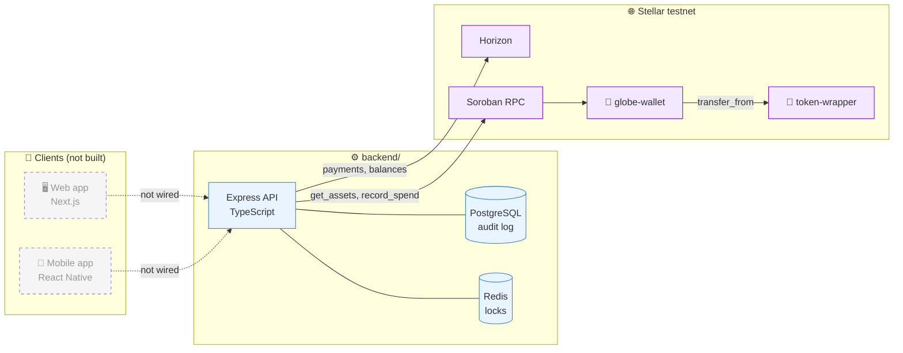
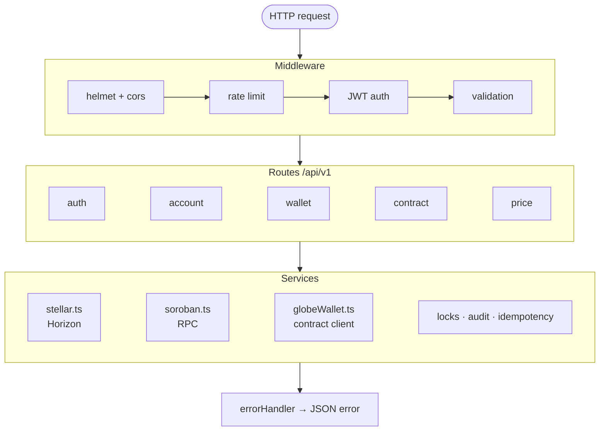
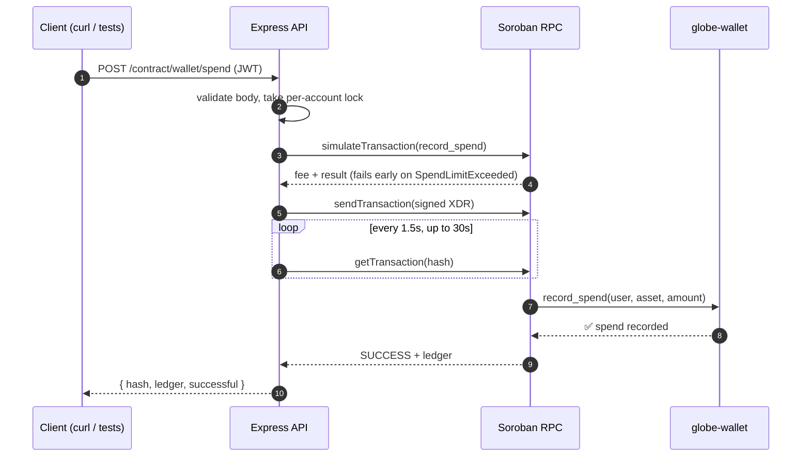
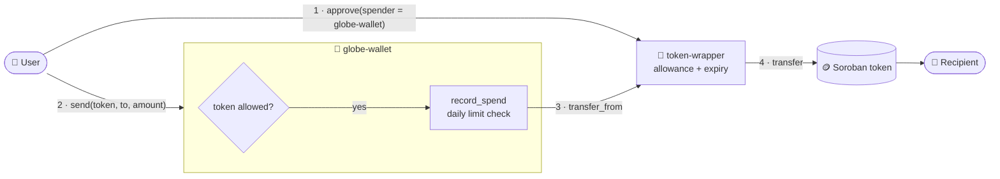
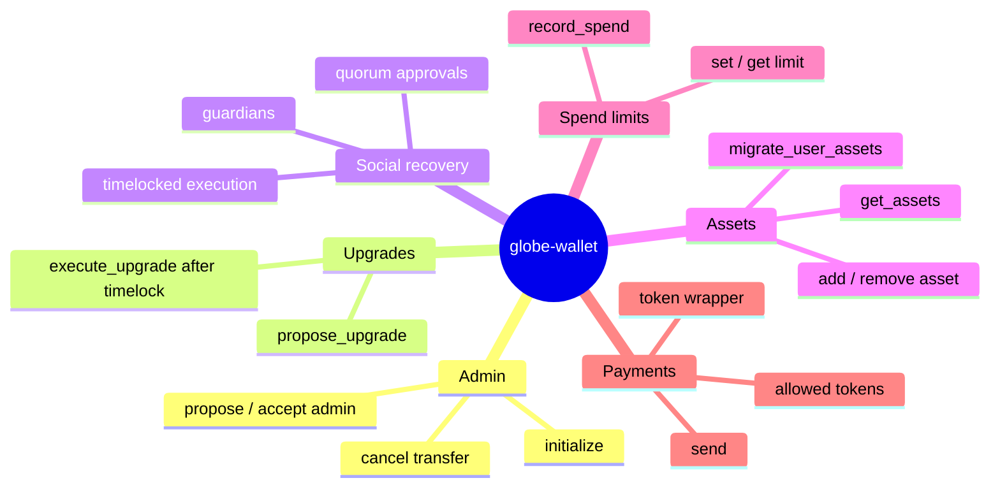
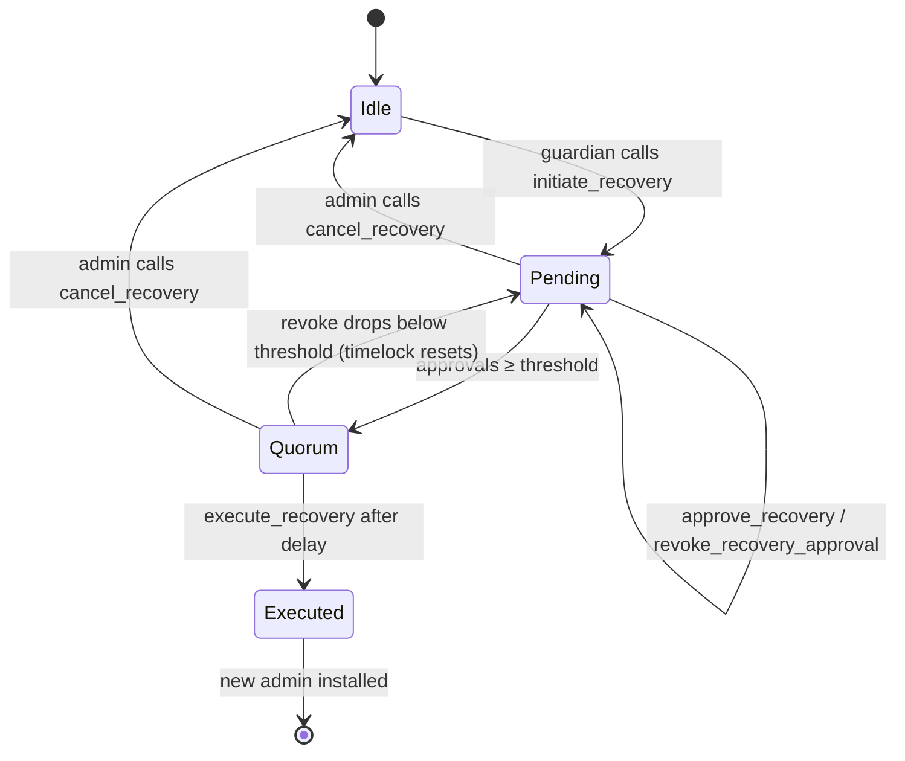
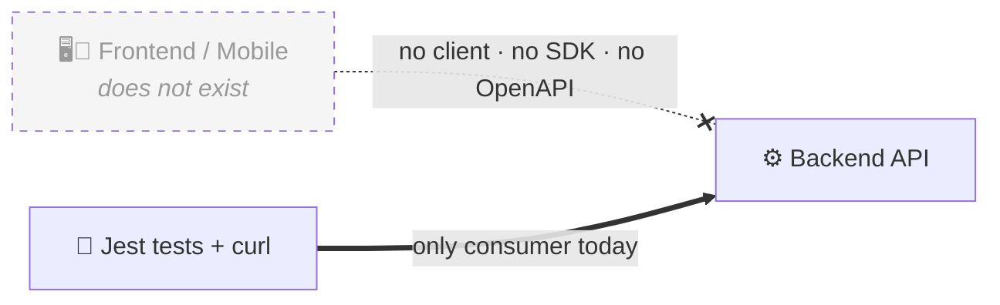
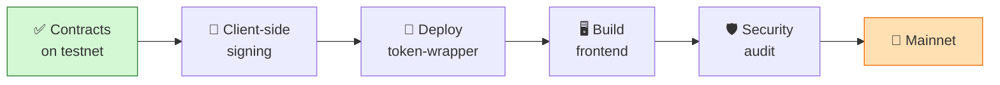

# 🌍 Stellar Global Wallet — Project Overview


Stellar Global Wallet (GlobeWallet) is a multi-asset wallet on Stellar. This monorepo holds the **backend API** and the **Soroban smart contracts**. The frontend and mobile app have not been built yet; the UI exists as a [Figma file template](https://claude.ai/artifact/HAEA9kUpEhSMCyjDwCBL6t#page-dcb81aee8d83).

---

## 🗺️ The big picture

Solid boxes exist today. Dashed boxes are still to be built.



| | Package | Stack | Status |
|:-:|---|---|:-:|
| ⚙️ | `backend/` | Node.js 20 · Express 4 · TypeScript · PostgreSQL · Redis | 🟡 Testnet |
| 📜 | `contract/` | Rust · Soroban SDK 21.7.7 | 🟡 Testnet |
| 🖥️ | Web frontend | Next.js (planned) | ⚪ Not started |
| 📱 | Mobile app | React Native / Expo (planned) | ⚪ Not started |

---

## ⚙️ Backend

### How a request flows through the layers



### Folder layout

```
backend/
├── src/
│   ├── index.ts · app.ts · config.ts · db.ts
│   ├── routes/        account · wallet · contract · auth · price
│   ├── middleware/    jwtAuth · apiKeyAuth (deprecated) · errorHandler · requestValidation
│   ├── services/      stellar · soroban · contracts/globeWallet · locks/ · auditLog · idempotency
│   ├── utils/         jwt · stellarAddress
│   └── validation/    stellarAsset
├── tests/             Jest + Supertest
└── docs/              concurrency · security-model · soroban-integration
```

### API map

| Group | Method | Endpoint | Auth |
|---|:-:|---|:-:|
| 💓 Health | `GET` | `/health` | — |
| 🔑 Auth | `POST` | `/api/v1/auth/login` · `/refresh` · `/logout` | API key → JWT |
| 👤 Account | `GET` | `/api/v1/account/:publicKey` · `/balances` · `/transactions` | — |
| 💸 Wallet | `POST` | `/api/v1/wallet/send` · `/fee-bump` · `/keypair` | 🔒 JWT |
| 🔀 Path payments | `POST` | `/wallet/path-payment-strict-send` · `/path-payment-strict-receive` · `/paths/strict-send` · `/paths/strict-receive` | 🔒 JWT |
| 👥 Multisig | `POST`/`GET` | `/wallet/partial-transaction` · `/submit-multisig` · `/:publicKey/thresholds` | 🔒 JWT |
| 📜 Contract | `GET` | `/api/v1/contract/wallet/:publicKey/assets` | — |
| 📜 Contract | `POST` | `/api/v1/contract/wallet/spend` | 🔒 JWT |
| 💲 Price | `GET` | `/api/v1/price/:asset` | — *(placeholder, returns `null`)* |

### A contract call, step by step



---

## 📜 Smart contracts

### The two contracts and how they compose



### `globe-wallet` capabilities



### Social recovery lifecycle



### Daily spend limit at a glance

| Rule | Behaviour |
|---|---|
| ⏱️ Window | 86,400 s, bucketed by ledger timestamp, resets automatically |
| ♾️ `limit = 0` | Unlimited |
| 🚫 Over limit | `SpendLimitExceeded` and no tokens move |
| ⚠️ Scope | Enforced inside `globe-wallet` only (see *bypass* below) |

### Folder layout

```
contract/
├── Cargo.toml                     workspace · release profile · ed25519-dalek patch
├── contracts/
│   ├── globe-wallet/              src/lib.rs · tests/ · test_snapshots/
│   └── token-wrapper/             src/lib.rs · test_snapshots/
├── vendor/ed25519-dalek-2.2.0/    pinned transitive dependency
└── docs/design/                   architecture · record_spend boundary · reentrancy threat model
```

---

## 🔌 Not connected to a frontend



The API has no real consumer yet. `CORS_ORIGIN` is preset for `localhost:3000` (Next.js) and `exp://localhost:8081` (Expo), but these are placeholders. The UI exists only as the Figma template.

---

## 🧪 Still on testnet

| | Setting | Value |
|:-:|---|---|
| 🌐 | Horizon | `https://horizon-testnet.stellar.org` |
| 🛰️ | Soroban RPC | `https://soroban-testnet.stellar.org` |
| 🔐 | Passphrase | `Test SDF Network ; September 2015` |
| 📜 | globe-wallet (demo) | `CBGLPMNSM4FWMIZ6FFBSRN7FNVCHCI2SLZNODA27LEOXFPLWNYEAEP3K` |
| 📜 | token-wrapper | ❌ not deployed |
| 🛡️ | Audit | ❌ none |

### Road to mainnet



---

## 🚀 Possible improvements

| Priority | Area | Improvement |
|:-:|---|---|
| 🔴 | Security | **Stop sending secret keys to the API.** `/wallet/send` and `/contract/wallet/spend` take `S...` keys in the body. Sign on the client (Freighter, xBull, passkeys) and submit XDR only. |
| 🔴 | Security | `/wallet/keypair` returns a secret key. Generate keys on the client instead. |
| 🔴 | Contracts | A direct `token-wrapper::transfer_from` call **bypasses the daily spend limit**. Restrict callers to globe-wallet. |
| 🔴 | Contracts | Third-party audit before mainnet. |
| 🟠 | Contracts | Upgrade `soroban-sdk` from 21.7.7, commit `Cargo.lock`, add deploy scripts per network. |
| 🟠 | Backend | Expose the full contract surface: assets, limits, guardians and recovery, `send`. |
| 🟠 | Backend | Publish an OpenAPI spec and a typed client for the frontend. |
| 🟡 | Backend | Real price oracle (Stellar DEX, Reflector or CoinGecko) in place of the placeholder. |
| 🟡 | Backend | Event indexer that writes contract events into Postgres. |
| 🟡 | DevOps | Dockerfile + docker-compose, lint / `clippy` / `fmt` in CI, end-to-end tests on testnet. |
| 🟢 | Product | Build the web and mobile apps from the Figma template. |
| 🟢 | Backend | Remove the deprecated `x-api-key` middleware. |

<sub>🔴 before mainnet · 🟠 next up · 🟡 soon · 🟢 planned</sub>
