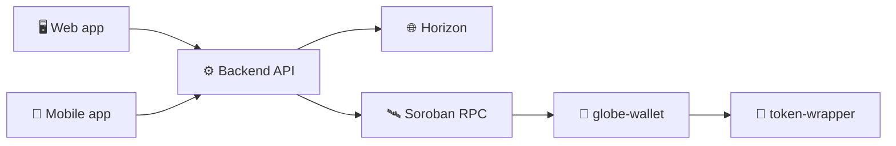
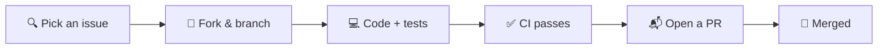

<div align="center">

# 🌍 Stellar Global Wallet

**A multi-asset wallet on Stellar with daily spend limits, guardian-based social recovery, and Soroban smart contracts.**


[🎨 Design](https://claude.ai/artifact/HAEA9kUpEhSMCyjDwCBL6t#page-dcb81aee8d83) · [📖 Project overview](HACKMD.md) · [🤝 Contribute](#-how-you-can-help)

</div>

---

## ✨ What it does

| | Feature | |
|:-:|---|---|
| 💸 | **Send and receive** | XLM and any Stellar asset, with path payments and fee bumps |
| 🪙 | **Multi-asset** | Users choose which assets their wallet tracks |
| 🛑 | **Daily spend limits** | Per-asset caps enforced on-chain |
| 🛡️ | **Social recovery** | Trusted guardians can restore access after a timelock |
| 👥 | **Multisig** | Partial signing and threshold management |
| ⬆️ | **Safe upgrades** | Contract upgrades and admin changes go through a timelock |

## 🏗️ Architecture



| Part | Path | Stack | Status |
|---|---|---|:-:|
| 🖥️ Web app | `frontend/` *(planned)* | Next.js · Tailwind | ⚪ Not started |
| 📱 Mobile app | `mobile/` *(planned)* | React Native · Expo | ⚪ Not started |
| ⚙️ Backend API | [`backend/`](backend/) | Node.js · Express · TypeScript · PostgreSQL · Redis | 🟡 Testnet |
| 📜 Smart contracts | [`contract/`](contract/) | Rust · Soroban | 🟡 Testnet |

The UI is designed in the [Figma file template](https://claude.ai/artifact/HAEA9kUpEhSMCyjDwCBL6t#page-dcb81aee8d83). For a deep dive into structure, testnet status and the roadmap, see **[HACKMD.md](HACKMD.md)**.

## 🚀 Quick start

```bash
git clone https://github.com/Genghis-codes/Stellar-Global-Wallet.git
cd Stellar-Global-Wallet
```

| Part | Setup |
|---|---|
| ⚙️ Backend | `cd backend && cp .env.example .env && npm install && npm run dev` |
| 📜 Contracts | `cd contract && cargo test --workspace` |
| 🖥️ / 📱 Apps | Not built yet. This is a great place to start contributing! |

Each package's README has full details.

## 🤝 How you can help

We welcome contributors of every level. Here's what we need most:

| | Area | What we need |
|:-:|---|---|
| 🐛 | **Bug fixes** | Reproduce and fix issues in the API or contracts, tighten input validation, improve error messages |
| ✨ | **New features** | Build the web and mobile apps from the Figma design, client-side signing with wallets like Freighter and xBull, a real price oracle, an event indexer, and more contract features exposed through the API |
| 📚 | **Documentation** | OpenAPI/Swagger spec, setup guides, architecture diagrams, contract usage examples, user-facing docs |
| 🧪 | **Testing** | More unit and integration tests, end-to-end tests on testnet, contract fuzzing and edge cases, frontend tests once the apps exist |

### Contribution flow



1. Browse the [open issues](https://github.com/Genghis-codes/Stellar-Global-Wallet/issues), or open one with the issue templates.
2. Read the package's `CONTRIBUTING.md` ([backend](backend/CONTRIBUTING.md) · [contract](contract/CONTRIBUTING.md)).
3. Keep each PR focused on one change, and include tests where it makes sense.

## ⚙️ CI

| Workflow | Runs when | Checks |
|---|---|---|
| `backend.yml` | `backend/` changes | Type-check, Jest tests |
| `contract.yml` | `contract/` changes | `cargo check`, `cargo test` |

## ⚠️ Status

This project is in **active development on Stellar testnet**. It has not been audited, so do not use it with real funds.
